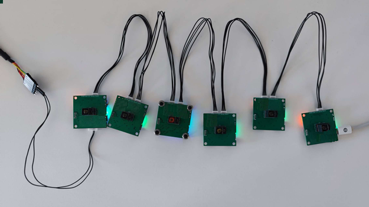
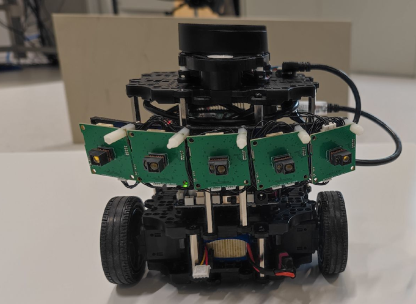

# Introduction #

This package contains ROS driver nodes for ToF Sensor AFBR-S50 with CAN and UART interface.

### System Configurations ###

* OS / ROS
	Ubuntu 22.04 / ROS Humble
* USB TO UART module
* AFBR-S50 mikroE sensor board (https://www.mikroe.com/bdc-afbr-s50-tof-sensor-board#/279-tof_sensor_board-bdc_afbr_s50mv85i)

# Quick Start

## Installation

### Installing ROS

Install "ROS Desktop Full" on Ubuntu PC.

- ROS Humble for Ubuntu 22.04
    - https://docs.ros.org/en/humble/Installation/Alternatives/Ubuntu-Development-Setup.html

## Installation of tof_driver ##


```
$ source /opt/ros/humble/setup.bash
$ mkdir -p ~/s50_tof_driver/src
$ cd s50_tof_driver/src/
$ catkin_init_workspace
$ git clone https://github.com/Broadcom/AFBR-S50-API.git
$ cd ~/s50_tof_driver
$ catkin_make
$ source ~/s50_tof_driver/devel/setup.bash
```

### Connecting Tof sensors ###

* Connect a bunch tof sensors through the CAN interface (e.g. https://www.mikroe.com/bdc-afbr-s50-tof-sensor-board#/279-tof_sensor_board-bdc_afbr_s50mv85i) to form a daisy chain
* Connect the Tof sensor to the USB port of your Ubuntu PC via USB TO UART module




### Launching Software ###
#### Option 1 : Publish original data to ROS ####

* Open a new terminal and launch the raw data publisher.
```
$ source ~/s50_tof_driver/devel/setup.bash
$ chmod -R 777 ~/s50_tof_driver/
$ roslaunch raw_tof raw_tof_c.launch
```

#### Option 2 : PointCloud in Rviz ####

* Open a new terminal and launch the pointcloud2 publisher.
```
$ rosrun rviz rviz
$ source ~/s50_tof_driver/devel/setup.bash
$ chmod -R 777 ~/s50_tof_driver/
$ roslaunch pointcloud_tof pointcloud.launch
```

For visualization and application tests an example implementation on a turtlebot using 5 x sensors boards is used.  
(https://www.mikroe.com/bdc-afbr-s50-tof-sensor-board#/279-tof_sensor_board-bdc_afbr_s50mv85i)  



The next image shows the streamed sensor data via Rviz showing a pointcloud of 5 x 32 pixels into the 3D-space.  


Here is an application video showing the capability of AFBR-S50 sensor for cliff detection.  

  

The video above shows the capability of Broadcom ToF sensors to be used for cliff and void detection on AMRs/AGVs. While the LIDAR (red dots) just see the side walls,
the downwards oriented ToF sensors (white point cloud) clearly detect the platform edges and initiates a direction change.
