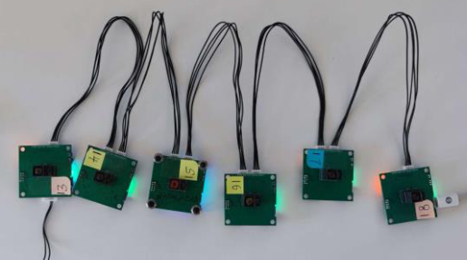
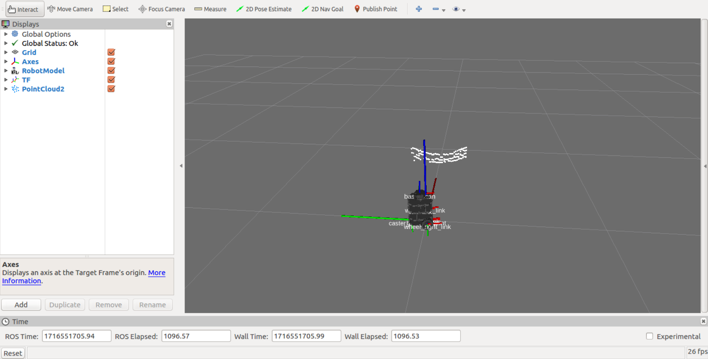

# Introduction #

This package contains ROS driver nodes for ToF Sensor AFBR-S50 with CAN and UART interface.

### System Configurations ###

* OS / ROS
	Ubuntu 16.04 / ROS Kinetic
* USB TO UART module
* AFBR-S50 mikroE

# Quick Start

## Installation

### Installing ROS

Install "ROS Desktop Full" on Ubuntu PC.

- ROS Kinetic for Ubuntu 16.04
    - http://wiki.ros.org/kinetic/Installation/Ubuntu

## Installation of tof_driver ##


```
$ source /opt/ros/kinetic/setup.bash
$ mkdir -p ~/s50_tof_driver/src
$ cd s50_tof_driver/src/
$ catkin_init_workspace
$ git clone https://github.com/toffffffffff.git
$ cd ~/s50_tof_driver
$ catkin_make
$ source ~/s50_tof_driver/devel/setup.bash
```

### Connecting Tof sensor ###

* Connect each tof sensor through the CAN interface to form a daisy chain
* Connect the Tof sensor to the USB port of your Ubuntu PC via USB TO UART module




### Launching Software ###
#### Option 1 : Publish original data to ROS ####

* Open a new terminal and launch the raw data publisher.
```
$ source ~/s50_tof_driver/devel/setup.bash
$ chmod -R 777 ~/s50_tof_driver/
$ roslaunch raw_tof raw_tof_c.launch
```


#### Option 2 : PointCloud in Rviz ####

* Open a new terminal and launch the pointcloud2 publisher.
```
$ rosrun rviz rviz
$ source ~/s50_tof_driver/devel/setup.bash
$ chmod -R 777 ~/s50_tof_driver/
$ roslaunch pointcloud_tof pointcloud.launch
```